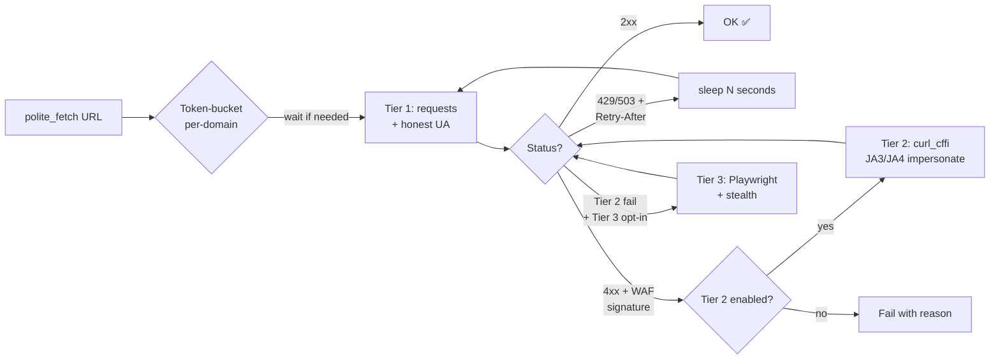

# polite-fetch

> Three-tier polite HTTP fetcher with `Retry-After` honoring, per-domain token-bucket rate limiting, and auto-escalation to TLS-fingerprint impersonation on WAF detection. Drop-in `requests`-compatible. 19 tests passing, zero hard dependencies for Tier-1.

[](https://github.com/M00C1FER/polite-fetch/actions)
[](https://pypi.org/project/polite-fetch/)
[](https://pypi.org/project/polite-fetch/)

## What it does

- **RFC 7231 §7.1.3 `Retry-After` honoring** — integer seconds OR HTTP-date.
- **Per-domain token-bucket rate limiting** — default 1 RPS / burst 5, configurable.
- **Full-jitter exponential backoff** — AWS-recommended pattern.
- **3-tier escalation** (the differentiator):
  1. Tier 1 — `requests` with honest contact-bearing UA (zero deps beyond stdlib + `requests`)
  2. Tier 2 — `curl_cffi` browser-impersonate (JA3/JA4 + HTTP/2 fingerprint)
  3. Tier 3 — `playwright + browserforge` (opt-in)
- **Anti-bot signature detection** — Cloudflare, DataDome, PerimeterX, Akamai, Imperva, Kasada.

## Why this exists

There's no Python library bundling the three layers behind one API. You either get etiquette (`PoliteScrape`, `dmi3kno/polite`), or fingerprint impersonation (`curl_cffi`), or stealth automation (`playwright-stealth`) — never all three with auto-escalation.

This library bundles them. Tier 1 is the polite default; Tier 2 fires automatically when a Cloudflare/DataDome/PerimeterX challenge is detected; Tier 3 is opt-in for the cases where headless rendering is unavoidable.

## Quick start

```bash
pip install polite-fetch
polite-fetch https://example.com
```

```python
from polite_fetch import polite_fetch

result = polite_fetch("https://api.example.com/data", max_attempts=4)
if result["ok"]:
    print(result["content"])
else:
    print(f"failed: {result['reason']}")
```

Drop-in `requests`-compatible:
```python
from polite_fetch import get
response = get("https://example.com")  # returns requests.Response
```

## How it works



## Comparison vs alternatives

| Library                            | Tier 1 (etiquette) | Tier 2 (TLS fingerprint) | Tier 3 (browser) | Auto-escalation |
|------------------------------------|:-:|:-:|:-:|:-:|
| `dmi3kno/polite` (R)               | ✅ | ❌ | ❌ | — |
| `CassandraMaldonado/PoliteScrape`  | ✅ | ❌ | ❌ | — |
| `lexiforest/curl_cffi`             | ❌ | ✅ | ❌ | — |
| `playwright-stealth` plugins       | ❌ | partial | ✅ | — |
| **`polite-fetch` (this project)**  | ✅ | ✅ | ✅ | **✅** |

## MCP server

`polite-fetch` ships an MCP server (FastMCP) exposing `polite_fetch_url` to any MCP client.

`claude_desktop_config.json`:
```json
{
  "mcpServers": {
    "polite-fetch": { "command": "polite-fetch-mcp" }
  }
}
```

Install with `pip install polite-fetch[mcp]`.

## Testing

```bash
pip install -e .[dev]
pytest
```

19 tests cover `parse_retry_after`, `full_jitter_backoff`, `_TokenBucket`, anti-bot detection, and `polite_fetch` integration (mocked Tier-1 + escalation paths).

## License

MIT.
